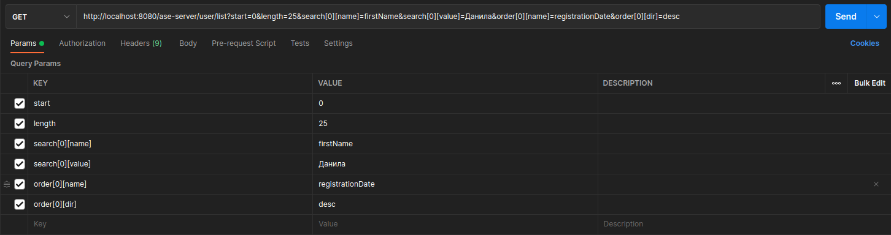

# D-datatable-request

[![NPM Version][npm-image]][npm-url]
[![License][license-image]][license-url]

Библиотека для создания параметров datatable-запроса.

# Установка NPM

```sh
npm i @dlabs71/d-datatable-request
```

# Использование

Данная библиотека может быть использована в любом js приложении, вне зависимости от фреймворка. Она предоставляет два
метода: метод для создания объекта описывающего **параметры фильтрации данных** в запросе и метода создания объекта
описывающего **параметры сортировки данных** в запросе.

Например, создадим запрос следующего вида:


**`api-service.js`**

```js
import axios from 'axios';
import {createSearchParams, createSortParams} from '@dlabs71/d-datatable-request';

export default {

    searchInUsers(searchData, sortData) {
        let searchParams = createSearchParams(searchData);
        let sortParams = createSortParams(sortData);

        return axios.get('/user/list', {
            params: {
                start: 0,
                length: 25,
                ...searchParams,
                ...sortParams
            }
        })
    }
}
```

**`example.js`**

```js
import ApiService from 'api-service.js';
import {SORT_DIR} from "@dlabs71/d-datatable-request";

let searchData = {
    firstName: "Данила"
};

let sortData = {
    registrationDate: SORT_DIR.DESC
};

ApiService.searchUsers(searchData, sortData);
```

# Документация

## Оглавление

* [1. Функция createSearchParams](#section1)
* [2. Функция createSortParams](#section2)

## <h2 id="section1">1. Функция createSearchParams</h2>

Функция createSearchParams - предназначена для создания объекта с параметрами фильтрации. Данная функция имеет несколько
параметров:

| **Параметр**   | **Тип**                  | **Значение по умолчанию**  | **Описание**     |
| :--------------| :------------------------| :------------------------- | :----------------|
| searchData     | Object или Array [Object]|                            | Исходный объект или массив объектов описывающих параметры фильтрации |
| keyField       | string                   | field                      | Используется если тип searchData - Array. Наименование атрибута объекта содержащего имя параметра фильтрации                  |
| valueField     | string                   | value                      | Используется если тип searchData - Array. Наименование атрибута объекта содержащего значение параметра фильтрации             |
| stringifyValue | boolean                  | true                       | Если true, то все значения создаваемых параметров имеющие тип Object или Array будут преобразованны в строку `JSON.stringify` |

В результате выполнения функции получится следующий объект:

```json
{
    "search[0][name]": "prop1",
    "search[0][value]": "value1",
    "search[1][name]": "prop2",
    "search[1][value]": "value2"
}
```

Примеры использования:

```js
import {createSearchParams} from '@dlabs71/d-datatable-request';

let searchData1 = {
    prop1: "value1",
    prop2: "value2"
}
createSearchParams(searchData1);
/*
 результат выполнения будет следующим:
 {
    "search[0][name]": "prop1",
    "search[0][value]": "value1",
    "search[1][name]": "prop2",
    "search[1][value]": "value2"
}
 */

let searchData2 = [
    {title: "prop1", value: "value1"},
    {title: "prop2", value: "value2"}
]
createSearchParams(searchData2, "title", "value");
/*
 результат выполнения будет следующим:
 {
    "search[0][name]": "prop1",
    "search[0][value]": "value1",
    "search[1][name]": "prop2",
    "search[1][value]": "value2"
}
 */

let searchData3 = [
    {title: "prop1", value: "value1"},
    {title: "prop2", value: {data: "data"}}
]
createSearchParams(searchData3, "title", "value", true);
/*
 результат выполнения будет следующим:
 {
    "search[0][name]": "prop1",
    "search[0][value]": "value1",
    "search[1][name]": "prop2",
    "search[1][value]": "{"data": "data"}"
}
*/

```

## <h2 id="section2">2. Функция createSortParams</h2>

Функция createSortParams - предназначена для создания объекта с параметрами сортировки. Данная функция имеет несколько
параметров:

| **Параметр**   | **Тип**                  | **Значение по умолчанию**  | **Описание**     |
| :--------------| :------------------------| :------------------------- | :----------------|
| sortData       | Object или Array [Object]|                            | Исходный объект или массив объектов описывающих параметры сортировки |
| keyField       | string                   | field                      | Используется если тип searchData - Array. Наименование атрибута объекта содержащего имя параметра сортировки                  |
| valueField     | string                   | value                      | Используется если тип searchData - Array. Наименование атрибута объекта содержащего значение параметра сортировки             |

В результате выполнения функции получится следующий объект:

```json
{
    "order[0][name]": "prop1",
    "order[0][dir]": "asc",
    "order[1][name]": "prop2",
    "order[1][dir]": "desc"
}
```

Примеры использования:

```js
import {createSortParams, SORT_DIR} from '@dlabs71/d-datatable-request';

let sortData1 = {
    prop1: SORT_DIR.ASC,
    prop2: SORT_DIR.DESC
}
createSortParams(sortData1);
/*
 результат выполнения будет следующим:
 {
    "order[0][name]": "prop1",
    "order[0][dir]": "asc",
    "order[1][name]": "prop2",
    "order[1][dir]": "desc"
}
 */

let sortData2 = [
    {title: "prop1", value: SORT_DIR.ASC},
    {title: "prop2", value: SORT_DIR.DESC}
]
createSortParams(sortData2, "title", "value");
/*
 результат выполнения будет следующим:
{
    "order[0][name]": "prop1",
    "order[0][dir]": "asc",
    "order[1][name]": "prop2",
    "order[1][dir]": "desc"
}
 */

let sortData3 = [
    {title: "prop1", value: false},
    {title: "prop2", value: true}
]
createSortParams(sortData3, "title", "value");
/*
 результат выполнения будет следующим:
{
    "order[0][name]": "prop1",
    "order[0][dir]": "desc",
    "order[1][name]": "prop2",
    "order[1][dir]": "asc"
}
 */

let sortData4 = [
    {title: "prop1", value: 0},
    {title: "prop2", value: 1}
]
createSortParams(sortData4, "title", "value");
/*
 результат выполнения будет следующим:
{
    "order[0][name]": "prop1",
    "order[0][dir]": "desc",
    "order[1][name]": "prop2",
    "order[1][dir]": "asc"
}
 */

```

[npm-image]: https://img.shields.io/npm/v/@dlabs71/d-datatable-request

[npm-url]: https://www.npmjs.com/package/@dlabs71/d-datatable-request

[license-image]: https://img.shields.io/badge/license-MIT-blue.svg

[license-url]: LICENSE